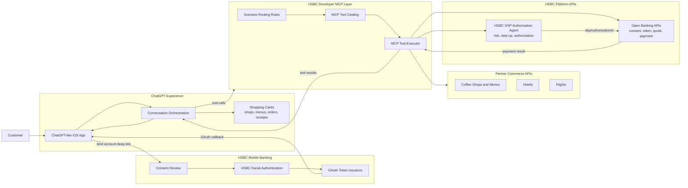
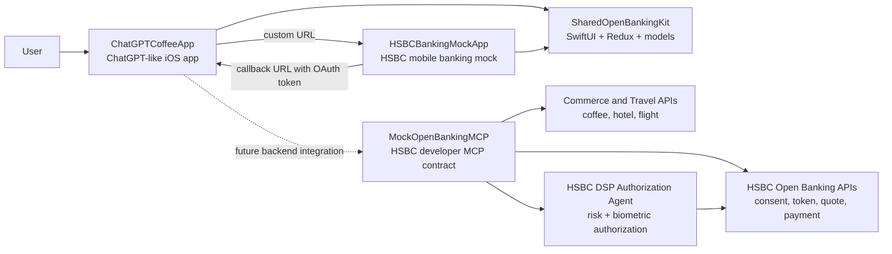
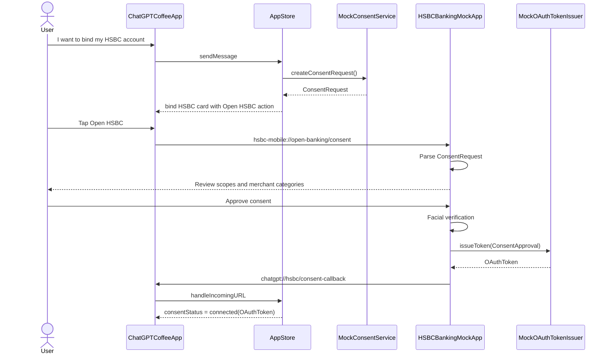
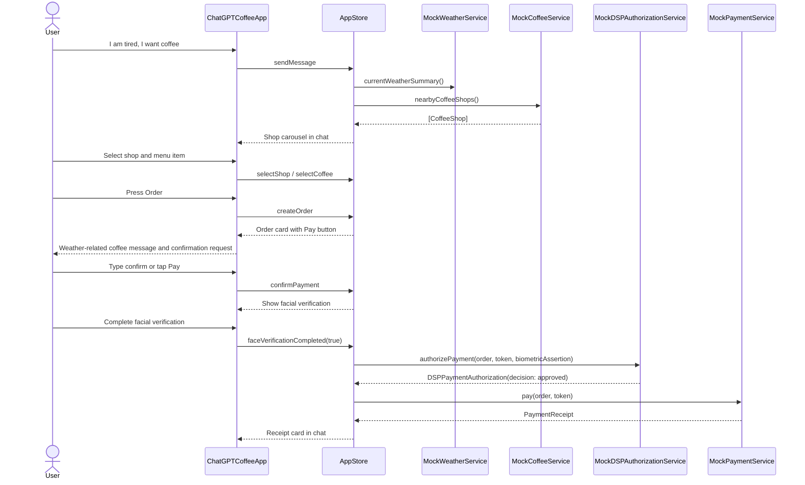
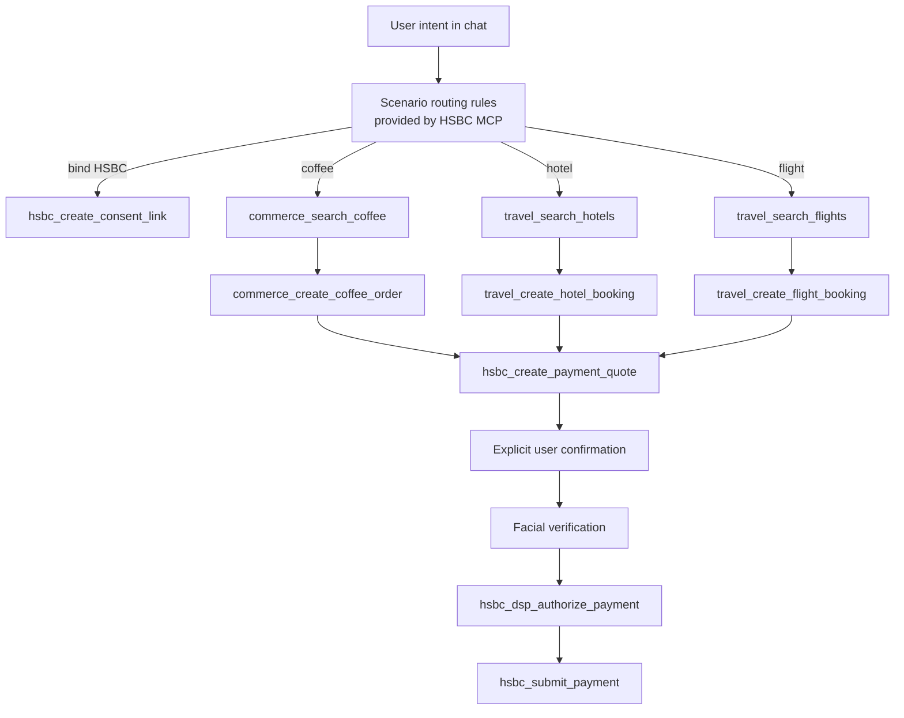
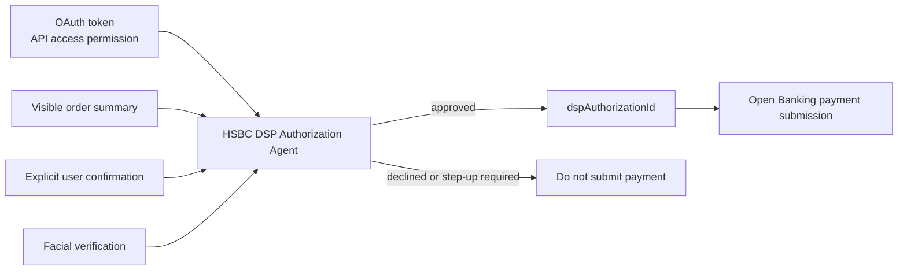
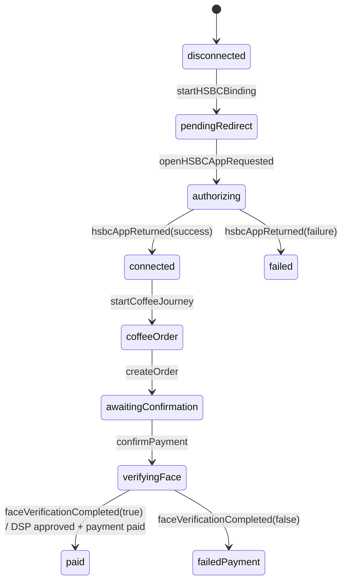

# HSBC DSP Authorization Agent via MCP Design

## Purpose

This prototype demonstrates how a ChatGPT-like iOS app can partner with HSBC to support conversational shopping while keeping banking consent, OAuth token issuance, biometric verification, DSP authorization, and payment execution inside clearly separated trust boundaries.

The current implementation focuses on coffee ordering first, while the MCP mock also defines hotel and flight scenarios so HSBC developers can describe when ChatGPT should call each API.

## System Overview

For standalone component and sequence diagrams, see [DIAGRAMS.md](DIAGRAMS.md).

## High-Level Architecture

## Codebase Structure

| Area | Path | Responsibility |
| --- | --- | --- |
| ChatGPT-like iOS app | `ChatGPTCoffeeApp/` | Native app shell that hosts the chat shopping experience. |
| HSBC banking mock app | `HSBCBankingMockApp/` | Native app shell that handles consent review, facial verification, and OAuth token callback. |
| Shared Swift package | `SharedOpenBankingKit/` | SwiftUI views, Redux-style state management, domain models, routing, and mock services. |
| MCP/backend mock | `MockOpenBankingMCP/` | OpenAPI contracts, MCP tool schemas, scenario routing rules, and TypeScript mock handlers. |

## Trust Boundaries

| Boundary | What It Owns | Current Mock |
| --- | --- | --- |
| ChatGPT-like app | Conversation, shop browsing, order card, explicit user confirmation, payment initiation. | `AppStore`, `ChatView`, `CoffeeViews`. |
| HSBC mobile banking app | Account consent, facial authentication for consent, OAuth token issuance. | `BankingAppStore`, `BankingRootView`, `MockOAuthTokenIssuer`. |
| HSBC Open Banking | Consent creation, OAuth token exchange, payment quote, final payment submission. | `MockConsentService`, `MockPaymentService`, `hsbc-openbanking.yaml`. |
| HSBC DSP Authorization Agent | Payment risk decision, step-up biometric requirement, one-payment authorization reference. | `DSPAuthorizationServicing`, `MockDSPAuthorizationService`, `hsbc_dsp_authorize_payment`. |
| HSBC developer MCP | Tool definitions and scenario guidance so ChatGPT knows which API to call for each user intent. | `mcp-tools.json`, `docs/scenario-routing.md`, `src/mock-server.ts`. |

## Journey 1: Bind HSBC Account

User intent: "I want to bind my HSBC account."

Implementation notes:

- `ConsentRequest` contains `clientId`, `callbackURL`, OAuth scopes, merchant categories, and validity.
- The current prototype uses custom URL schemes:
  - `hsbc-mobile://open-banking/consent`
  - `chatgpt://hsbc/consent-callback`
- Production should use universal links and OAuth authorization code + PKCE.
- OAuth token scope includes:
  - `accounts:read`
  - `payment-quote:create`
  - `dsp-payment:authorize`
  - `coffee-payment:submit`
  - `travel-payment:submit` for future hotel/flight journeys.

## Journey 2: Coffee Discovery, Order, DSP Authorization, Payment

User intent: "I am tired, I want coffee."

Current Swift mock behavior:

- `routeUserMessage` starts the coffee journey when the message contains `coffee` or `tired`.
- `loadCoffeeShops` combines weather and nearby coffee data.
- `createOrder` creates a `CoffeeOrder` with `awaitingConfirmation` status.
- `confirmPayment` requires a connected HSBC OAuth token.
- `faceVerificationCompleted(true)` calls `authorizeAndPay`.
- `authorizeAndPay` first calls `DSPAuthorizationServicing`, then calls `PaymentServicing`.

## MCP Tool Flow

HSBC developers provide MCP tool definitions so ChatGPT can map user scenarios to API calls.

MCP tools currently defined:

| Tool | When ChatGPT Should Use It |
| --- | --- |
| `hsbc_create_consent_link` | User wants to bind/connect HSBC or use HSBC for payment. |
| `commerce_search_coffee` | User wants coffee, caffeine, nearby cafes, Starbucks, Luckin, or drink recommendations. |
| `commerce_create_coffee_order` | User selected a coffee shop and menu item. |
| `travel_search_hotels` | User wants hotel/accommodation. |
| `travel_create_hotel_booking` | User selected hotel and room. |
| `travel_search_flights` | User wants flight/airline tickets. |
| `travel_create_flight_booking` | User selected flight itinerary. |
| `hsbc_create_payment_quote` | An unpaid order or booking exists before final payment confirmation. |
| `hsbc_dsp_authorize_payment` | User explicitly confirms payment and DSP must authorize this specific transaction. |
| `hsbc_submit_payment` | DSP returned an approved `dspAuthorizationId`. |

## DSP Authorization Model

OAuth consent and DSP authorization are intentionally different.

Rules:

- OAuth token means ChatGPT is allowed to call permitted HSBC APIs.
- DSP authorization means this specific payment is approved.
- ChatGPT must not submit payment based only on inferred user intent.
- ChatGPT must show a visible order or booking summary before payment.
- ChatGPT must require explicit confirmation, such as typing `confirm` or tapping Pay.
- Final payment submission must include a DSP authorization reference.

## Redux State and Actions

The ChatGPT-like app uses a Redux-style store:

Important state:

- `consentStatus`: disconnected, pending redirect, authorizing, connected, or failed.
- `messages`: chat history and assistant cards.
- `shops`, `selectedShop`, `selectedItem`: coffee browsing state.
- `currentOrder`: order summary and status.
- `receipt`: payment result.
- `isShowingFaceVerification`: controls the face verification sheet.

Important actions:

- Consent: `startHSBCBinding`, `consentRequestCreated`, `openHSBCAppRequested`, `handleIncomingURL`, `hsbcAppReturned`.
- Coffee: `startCoffeeJourney`, `shopsLoaded`, `selectShop`, `selectCoffee`, `createOrder`.
- Payment: `confirmPayment`, `faceVerificationCompleted`, `paymentCompleted`.

## Domain Model Summary

| Model | Purpose |
| --- | --- |
| `ConsentRequest` | Request sent from ChatGPT app to HSBC app for user consent. |
| `OAuthToken` | Mock token returned after HSBC consent. Includes scopes, expiry, account mask, and consent ID. |
| `HSBCScope` | Open Banking and DSP permissions. |
| `CoffeeShop`, `CoffeeItem`, `CoffeeOrder` | Merchant discovery and order summary. |
| `DSPPaymentAuthorization` | DSP decision for a specific payment quote/order. |
| `PaymentReceipt` | Final paid transaction result. |
| `ChatMessage`, `ChatAttachment` | Chat transcript plus rich cards for binding, shops, order, and receipt. |

## API Contracts

OpenAPI contracts live in:

- `MockOpenBankingMCP/openapi/hsbc-openbanking.yaml`
- `MockOpenBankingMCP/openapi/commerce-travel.yaml`

Key HSBC Open Banking endpoints:

- `POST /consents`
- `POST /oauth/token`
- `POST /payment-quotes`
- `POST /dsp/payment-authorizations`
- `POST /payments`
- `GET /payments/{paymentId}`

The current iOS app still uses local Swift mock services. The OpenAPI and MCP files define the intended backend contract for replacing local mocks later.

## Production Hardening

Before production, replace the mock pieces with:

- OAuth authorization code + PKCE and universal links.
- Secure token exchange and storage, preferably server-side with Keychain only for client secrets that belong on device.
- Real HSBC DSP risk policy, signed biometric assertions, device binding, replay protection, and audit logging.
- Idempotency keys for payment submission.
- Consent revocation and token refresh.
- Clear merchant identity, amount, currency, pickup/booking details, and cancellation policy before confirmation.
- Server-side MCP implementation with strict tool allowlists and payment safety checks.
