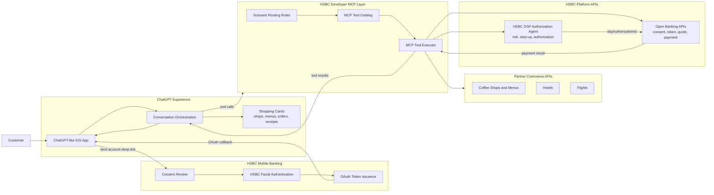
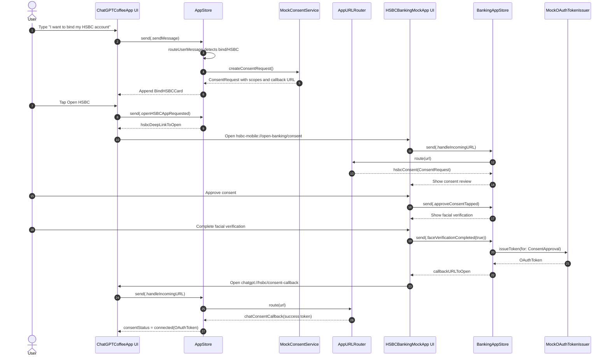
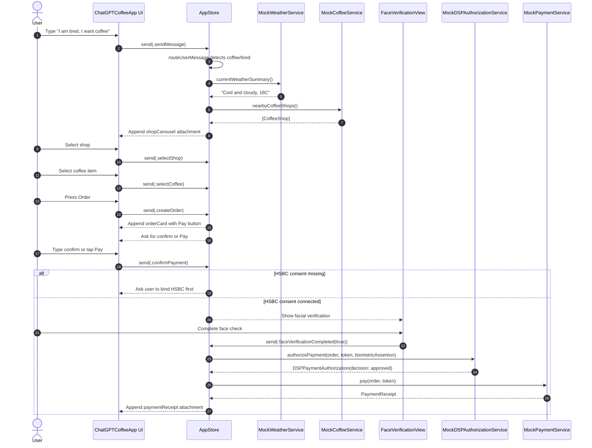
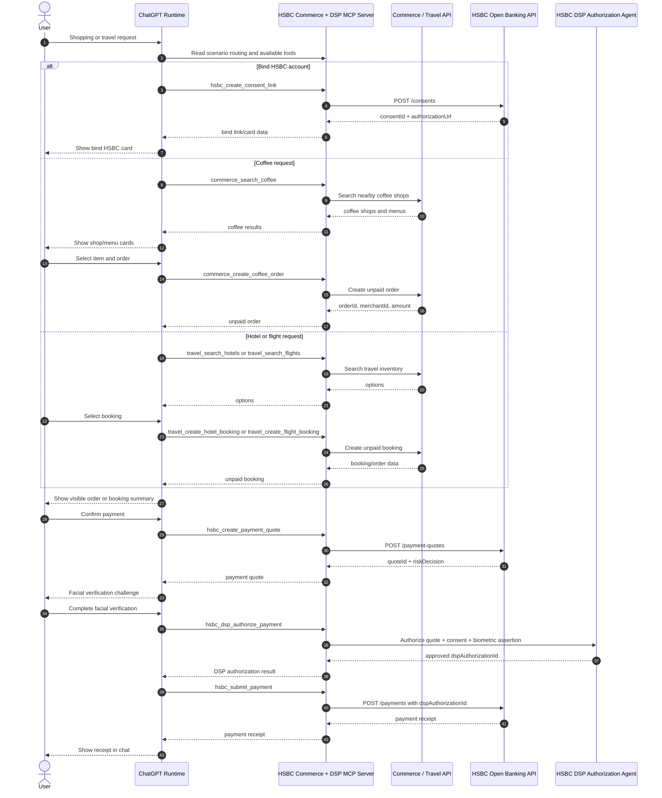

# Component and Sequence Diagrams

## High-Level Architecture Diagram

## Component Diagram

```mermaid
flowchart TB
    User[User]

    subgraph IOS[iOS Simulator / iPhone]
        subgraph ChatApp[ChatGPTCoffeeApp]
            ChatRoot[ChatGPTLikeDemoRoot]
            RootView[RootView]
            ChatView[ChatView]
            CoffeeViews[ShopCarousel / OrderCard / ReceiptCard]
            ConsentViews[BindHSBCCard / FaceVerificationView]
        end

        subgraph BankApp[HSBCBankingMockApp]
            BankRoot[HSBCBankingDemoRoot]
            BankingView[BankingRootView]
            ConsentReview[ConsentReviewCard]
            BankFace[BankingFaceVerificationView]
        end

        subgraph Shared[SharedOpenBankingKit]
            AppStore[AppStore]
            AppState[AppState / AppAction]
            BankStore[BankingAppStore]
            BankState[BankingAppState / BankingAppAction]
            Router[AppURLRouter]
            Models[Domain Models]
            ConsentService[MockConsentService]
            OAuthIssuer[MockOAuthTokenIssuer]
            CoffeeService[MockCoffeeService]
            WeatherService[MockWeatherService]
            DSPService[MockDSPAuthorizationService]
            PaymentService[MockPaymentService]
            Biometric[LocalBiometricAuthorizer]
        end
    end

    subgraph MCP[MockOpenBankingMCP]
        ToolSchemas[mcp-tools.json]
        ScenarioRules[docs/scenario-routing.md]
        MockServer[src/mock-server.ts]
        HSBCOpenAPI[openapi/hsbc-openbanking.yaml]
        CommerceOpenAPI[openapi/commerce-travel.yaml]
        SeedData[data/*.json]
    end

    subgraph Backend[Future Production Services]
        CommerceAPI[Commerce / Travel APIs]
        OpenBankingAPI[HSBC Open Banking APIs]
        DSPAgent[HSBC DSP Authorization Agent]
    end

    User --> ChatView
    User --> BankingView

    ChatRoot --> RootView --> ChatView
    ChatView --> CoffeeViews
    ChatView --> ConsentViews
    RootView --> AppStore
    AppStore --> AppState
    AppStore --> ConsentService
    AppStore --> CoffeeService
    AppStore --> WeatherService
    AppStore --> DSPService
    AppStore --> PaymentService
    RootView --> Router

    BankRoot --> BankingView
    BankingView --> ConsentReview
    BankingView --> BankFace
    BankingView --> BankStore
    BankStore --> BankState
    BankStore --> OAuthIssuer
    BankStore --> Router

    ConsentService --> Models
    OAuthIssuer --> Models
    CoffeeService --> Models
    DSPService --> Models
    PaymentService --> Models

    ChatApp -- hsbc-mobile://open-banking/consent --> BankApp
    BankApp -- chatgpt://hsbc/consent-callback --> ChatApp

    ToolSchemas --> MockServer
    ScenarioRules --> MockServer
    HSBCOpenAPI --> MockServer
    CommerceOpenAPI --> MockServer
    SeedData --> MockServer

    MockServer -. production replacement .-> CommerceAPI
    MockServer -. production replacement .-> OpenBankingAPI
    MockServer -. production replacement .-> DSPAgent
    DSPAgent --> OpenBankingAPI
```

## Sequence Diagram: HSBC Account Binding and OAuth Token

## Sequence Diagram: Coffee Order, DSP Authorization, Payment

## Sequence Diagram: Future MCP Tool Orchestration

